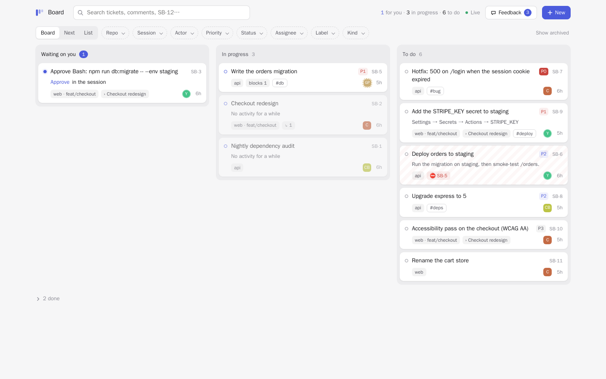

# session-board

One ticket board for **all** your Claude Code work, terminal and claude.ai/code cloud alike, and for
every agent and subagent that works with you: what is **waiting on you**, what is **in progress**,
what to do **next**. Every ticket knows its session, repository, branch, machine and who opened it,
so you can look at everything at once or at one repo, one session, one agent. The page updates live.

```
WAITING ON YOU (3)
  ⌨ SB-5 Approve Bash: npm run db:migrate -- --env staging · 6m · api@fix/token-refresh
  ⌨ SB-6 Add REFRESH_LOCK_TTL to the staging secrets · 38m · api@fix/token-refresh
  ☁ SB-7 Add a sliding-window rate limiter to the public API [review] · 22m · api@claude/rate-limit
      PR: https://github.com/acme/api/pull/412
      open: https://claude.ai/code/session_01…

IN PROGRESS (2)
  ⌨ SB-1 Fix the token refresh race in the auth middleware · 2h · api@fix/token-refresh
  ⌨ SB-17 Accessibility pass on the product page (WCAG AA) · 25m · web

TO DO (4)
  ⌨ SB-4 Add a regression test · 2h · api@fix/token-refresh
  …
```



More in [`docs/screenshots`](docs/screenshots): the *Next* view, a ticket with its dependencies and
its *who → whom* history, the feedback inbox, light and dark, desktop and phone, and a change made in
one tab showing up in another without a reload.

## Tickets, sessions, and where tickets come from

A **ticket** is the unit of the board: key (`SB-12`), title, markdown body, status, kind, assignee
(`user`, `claude`, or any agent id), priority `P0`–`P3`, labels, sub-tickets, dependencies, links
(PR, cloud session, file, URL), and a history of every change and comment, with who made it and for
whom. A **session** is a context: a session has zero, one or many tickets, and you filter on it.

Statuses: `todo`, `in_progress`, `waiting_on_user`, `review`, `done`, `cancelled`, `failed`. The
board's columns are derived: **Waiting on you** = waiting on you, in review or failed, assigned to
you; **In progress**; **To do**; **Done** folded away. Done tickets older than 30 days leave the
default views (they are never deleted; *Show archived* brings them back).

Tickets come from three places:

1. **Hooks, automatically.** Each session gets one ticket that follows it (in progress while Claude
   works, *review* when the turn ends, *failed* on an API error, *done* when the session ends). A
   permission prompt or a question opens a *waiting on you* sub-ticket that closes by itself when the
   session moves on. One review ticket per session, not one per turn.

   | Hook event | Ticket |
   | :- | :- |
   | `UserPromptSubmit`, `PreToolUse`, `PostToolUse` | session ticket **in progress**; open questions close (tool calls throttled to one report per 20 s) |
   | `PermissionRequest`, `Elicitation`, `Notification` (`permission_prompt`, `elicitation_dialog`, `agent_needs_input`) | a **waiting on you** ticket (*Approve Bash: …*, or the question) |
   | `Stop`, `Notification` (`agent_completed`) | session ticket **review**, with the end of Claude's last message and the PR link |
   | `StopFailure` | session ticket **failed**, with the error |
   | `SessionEnd` | session ticket **done**; unanswered questions cancelled |
   | `TaskCreated`, `TaskCompleted` | Claude's own task list mirrored as `claude` tickets (`SESSION_BOARD_MIRROR_TASKS=0` to turn off) |
   | `SubagentStart`, `SubagentStop` | a line in the session ticket's history: *Claude → Explore: started it*, *Explore → Claude: finished: …* |

2. **Claude, through MCP tools.** The plugin ships a small MCP server (`ticket_create`,
   `ticket_update`, `ticket_next`, `ticket_list`, `ticket_comment`, `ticket_get`, `board_feedback`)
   and a skill telling Claude when to use them: an action item only you can do ("add the
   `STRIPE_KEY` secret", "review PR #412"), a long task split into prioritized sub-tickets with their
   dependencies, what to pick next, what is left at the end, and what wasted its time. Tickets attach
   to the current session and repo by themselves.
3. **You**, from the web page (create, edit title / status / labels / priority, comment, close,
   sub-tickets) or the terminal (`/ticket`).

The hook is one zero-dependency Node script. It never blocks or fails your session: network calls
time out after 2 s, every error is swallowed, it always exits 0, and hot-path events run `async`.

## Realtime

The page keeps one connection open to `GET /api/stream` (Server-Sent Events) and redraws only the
cards that changed, with a short flash, the moment a hook, an agent or another tab changes a ticket:
no reload, no flicker. The dot in the header says **Live**; if the stream cannot be opened (a proxy
that buffers, a network change) it reconnects by itself with backoff and polls every 10 s meanwhile
(**Polling**). An open ticket refreshes too, unless you are editing it.

The stream sends one `change` event per committed change, with a minimal payload
(`{ type, op, key, fields, version }`: `type` is `ticket`, `comment`, `dependency`, `reorder` or
`session`), and a `:` heartbeat comment every 15 s. Its headers (`Cache-Control: no-cache`,
`X-Accel-Buffering: no`) keep nginx and similar proxies from buffering it. If you put the server
behind your own reverse proxy, make sure it streams responses (for nginx, `proxy_buffering off` is
implied by the header; for a Node relay, pipe the body instead of reading it whole).

## Dependencies and priority

- **Priority** `P0` (drop everything) to `P3` (some day); 0.2 values are migrated
  (`urgent`→`P0`, `high`→`P1`, `medium`→`P2`, `low`→`P3`), and the API still accepts those names.
- **"A blocks B"**: `blocked_by` on create, `blocked_by_add` / `blocked_by_remove` on update (API,
  MCP, `/ticket block SB-5 --by SB-3`, or the *Dependencies* section of the ticket panel). Many to
  many; a dependency that would close a cycle is refused. Each ticket carries `blocked` (an open
  blocker remains), `blocked_by` and `blocking`. A blocked card is hatched with a ⛔ badge. When its
  last blocker is done (or cancelled), the ticket is unblocked by itself and its history says so;
  reopening the blocker blocks it again.
- **Manual order**: drag a card in the *To do* column or a row in *Next* (`POST
  /api/tickets/SB-5/move { before | after }`). Dropped among tickets of another priority, it takes
  that priority.
- **Next** (page view, `GET /api/tickets/next`, MCP `ticket_next`, `/ticket next`): open tickets that
  nothing blocks (to do and in progress), most important first, then your manual order, then the
  oldest. Session, question and feedback tickets are not work and stay out. Same filters as the list
  (repo, session, actor, assignee, label…), plus the number of blocked tickets left aside.

## Actors and threads

An **actor** is whoever acts on the board: `{ id, type: human | agent | subagent | system, name }`.
Built in: `user` (you), `claude`, and `hook` (the session itself). Every history line carries its
`actor` and, when there is one, a `target`: *CI bot → You* for a comment addressed to you, *Claude →
Explore* when Claude starts a subagent, *Explore → Claude* when it reports back (from the
`SubagentStart` / `SubagentStop` hooks, `agent_id` and `agent_type`), *Claude → ci-bot* when a
ticket is handed over. Tickets record `created_by`; `assignee` takes any actor id (`user` and
`claude` work as before). Cards show the assignee's avatar; the *Actor* filter shows what an actor
holds or opened.

Optional environment variables, all off by default (nothing changes when they are unset), read by
the hooks and the MCP server of a session:

| Variable | Effect |
| :- | :- |
| `SESSION_BOARD_ACTOR` | id of the agent running this session (e.g. `ci-bot`, `job-42`), instead of `claude`; its subagents become `ci-bot/Explore` |
| `SESSION_BOARD_ACTOR_NAME` | its display name |
| `SESSION_BOARD_THREAD` | one stable name for a conversation that lives across several short sessions (a bot, a tmux loop, CI): all those sessions share **one** session ticket, which follows the latest session and is not closed at `SessionEnd` |
| `SESSION_BOARD_SESSION_TICKETS=0` | no automatic tickets at all for this session (session, questions, task mirror, subagent lines): for routine or scripted sessions. Tickets created explicitly through MCP still attach to the session |

## Feedback inbox

A board-wide inbox for what does not work or could work better, written by the sessions themselves.
The MCP tool `board_feedback` (`title`, `detail`, `type`: `bug` | `suggestion` | `friction`,
optional `about` and `priority`) files a ticket of kind `feedback`, with its context attached
(session, repo, branch, machine, actor, plugin version). The skill tells every session to use it as
soon as a tool, an instruction or the board itself makes it lose time, or when it sees an
improvement.

Feedback stays out of the board and the lists (ask for it with `kind=feedback`). The page has its
own **Feedback** view, with the open count in the header, filters by type, actor and repo, and a
resolution box: *Mark handled* (`done`) or *Won't do* (`cancelled`), with a comment kept in the
history.

## Install

Requires Node.js 22.13 or later (the board is stored with the built-in `node:sqlite`), on the `PATH`
of the shell that starts `claude`. On Windows, check it in that same shell (PowerShell, cmd or Git
Bash): `node --version`.

### Terminal sessions: a fresh install

```bash
claude plugin marketplace add Iskandeur/session-board
claude plugin install session-board@session-board
```

Then restart the sessions that are already open: a plugin loads when a session starts. That's it for
**local mode**: tickets live in `~/.claude/session-board/board.db` (on Windows
`%USERPROFILE%\.claude\session-board\board.db`) and cover every session on this machine.

### Updates

Each release bumps `version` (Claude Code caches a plugin by its version: "a manifest that pins
`version` keeps every user on the cached copy until its author changes the string", [plugin
loading](https://code.claude.com/docs/en/plugins/loading)). Where each kind of session gets it:

- **Terminal sessions (the plugin from this marketplace): turn auto-update on once.** Claude Code
  updates a plugin by itself only "when the marketplace they came from has auto-update turned on",
  and that is "off by default" for every marketplace that is not an official one; `marketplace.json`
  "has no field to turn it on" ([install and manage
  plugins](https://code.claude.com/docs/en/discover-plugins), [host a
  marketplace](https://code.claude.com/docs/en/plugins/host-marketplace)). So, once per machine:
  `/plugin` → **Marketplaces** → `session-board` → **Enable auto-update**. Or in
  `~/.claude/settings.json`:
  ```json
  { "extraKnownMarketplaces": { "session-board": { "source": { "source": "github", "repo": "Iskandeur/session-board" }, "autoUpdate": true } } }
  ```
  From then on, a few minutes after the first message of a session, Claude Code fetches the new
  version; it loads at the next start (or `/reload-plugins` in the open session). With a server, a
  session whose plugin is older than the server says so once, with the command to update now.
  `DISABLE_AUTOUPDATER=1` also turns plugin updates off unless `FORCE_AUTOUPDATE_PLUGINS=1` is set.
- **Cloud sessions, per environment**: automatic since 0.3.3, with the setup script on `main` (see
  *Cloud sessions*): the clone-time hook checks the published version (one 5-second request at most
  every 10 minutes) and replaces the environment's copy when it is newer, even when the environment
  is cached and the setup script is skipped.
- **Cloud sessions, per repository** (committed copy): run `/session-board:install-cloud` again and
  commit; a stale copy says so at session start.
- **`claude --plugin-dir <clone>`** (agents, scripts): keep the clone on `main` (`git pull --ff-only`
  on a timer); the next session started loads it.
- **The server**: `git pull && docker compose up -d --build`. Update it first when a release says so.

### Terminal sessions: updating from 0.2.x

```bash
claude plugin marketplace update session-board
claude plugin update session-board@session-board
```

Then restart every open session (`/exit`, then `claude --continue` to pick the conversation back
up). If you run a server, update it **first** (`git pull && docker compose up -d --build`): 0.3
migrates the database in place (priorities, creators) after a full copy next to it
(`board.db.schema1-<date>.bak`), and the 0.3 page needs the 0.3 API. A local `board.db` left by 0.2.0
moves to the server by itself at the next start (see *Storage and upgrades*). From 0.1: your existing
sessions are imported on first use (local `sessions/*.json`, or the server's `board.json`, which is
kept as `board.json.migrated`).

### Pointing a machine at a server

Run the server once, anywhere reachable over HTTPS:

```bash
git clone https://github.com/Iskandeur/session-board && cd session-board
openssl rand -hex 32 > token && chmod 600 token
docker compose up -d --build        # or: SESSION_BOARD_TOKEN=… node server/server.mjs
```

Then give each machine the URL and the token, in any of these ways (first match wins):

1. environment: `SESSION_BOARD_URL=https://board.example.com` and `SESSION_BOARD_TOKEN=…`. The
   simplest place, identical on every OS, is the `env` block of `~/.claude/settings.json`
   (Windows: `%USERPROFILE%\.claude\settings.json`):
   ```json
   { "env": { "SESSION_BOARD_URL": "https://board.example.com", "SESSION_BOARD_TOKEN": "…" } }
   ```
2. the plugin's own settings, asked at install time and editable in `/config` (the token is kept in
   secure storage). The hooks and the MCP server read them; the status line does not, so prefer 1 or
   3 if you want it;
3. `~/.claude/session-board/config.json`: `{ "url": "…", "token": "…" }`.

The hooks, `/board`, `/ticket` and the MCP server all use the same setting. Agents and scripts that
start `claude` themselves can load the plugin without installing it (`claude --plugin-dir
<clone of this repo>`) and name themselves with the variables of *Actors and threads*.

### Checking that it works

1. `/session-board:board` (or `/board`) prints the board. Its first line ends with `source: server`
   when the URL and token are picked up (`source: this machine (local mode)` otherwise); an
   unreachable server prints
   `could not load the board`.
2. Ask Claude: *“create a test ticket on the board”*. It calls `ticket_create`; the ticket shows on
   the page within a second (open `https://board.example.com/#token=<token>` once, the browser
   remembers the token). Delete the test session afterwards from the page, or with
   `DELETE /api/sessions/<id>`.
3. Under the prompt, a status line such as `2 for you · 3 in progress · 5 to do` (empty counts are
   left out; Claude Code 2.1.287 or later).
4. Nothing shows? Start one session with `SESSION_BOARD_DEBUG=1` (PowerShell:
   `$env:SESSION_BOARD_DEBUG=1; claude`) to print the hook errors, and try
   `curl https://board.example.com/healthz`, which answers without a token.

Sessions on claude.ai/code do not load plugins: see *Cloud sessions* below.

### Storage and upgrades

Tickets live in one place at a time: the server when a URL and token are set, else
`~/.claude/session-board/board.db` on this machine. When that changes:

- **Local → server** (you set up a server, or 0.2.0 kept Claude's tickets local because its MCP
  server did not receive the plugin settings): at the next session start, the hook sends the local
  `board.db` to the server once (`POST /api/import`): tickets with their status, dates, labels, links,
  sub-tickets, comments and history, plus the sessions the server does not know. Keys are renumbered
  on the server (`SB-3` may become `SB-57`; the ticket history says which key it had). Each ticket is
  recorded with its origin, so a second import never creates a duplicate, and the session tickets the
  server already follows through the hooks are not copied twice. When everything is in, `board.db` is
  renamed to `board.db.uploaded-<date>` (never deleted) and the session shows one line:
  `session-board: 4 tickets from this machine's local board moved to the board on board.example.com`.
- **If it cannot finish** (server down, out of time, server older than 0.2.3): nothing is renamed,
  the start shows how many tickets are still local, once, and it retries at every start. To retry
  now: `/session-board:board sync`.
- **Server → local, or one server → another**: nothing is moved. The next start says where the
  tickets stayed.

The import needs the server to be 0.2.3 or later: update it (`git pull && docker compose up -d
--build`) before or with the plugin.

### API

Every `/api/*` route needs `Authorization: Bearer <token>`. A client may say who it is with
`x-session-board-actor: <id>` (and `x-session-board-actor-name`); the plugin's MCP server does. `GET /` serves the web page (open it once
as `/#token=<token>`, the browser remembers it); `GET /healthz` answers without a token.

| Route | |
| :- | :- |
| `GET /api/tickets` | list, newest first, paginated (`limit` ≤ 500, `offset`) |
| `GET /api/tickets/board` | the same filters, grouped in board columns |
| `GET /api/tickets/next` | open, unblocked work by priority → manual rank → age (same filters), plus the `blocked` count |
| `POST /api/tickets/SB-12/move` | `{ before }` or `{ after }`: manual order |
| `GET /api/stream` | Server-Sent Events: one `change` per change, a heartbeat every 15 s |
| `GET /api/actors` | actors with their type, name, parent and open-ticket count |
| `POST /api/tickets` | create `{ title, body, status, kind, subtype, assignee, priority, labels, parent, blocked_by, links, session_id, repo, branch }` |
| `GET /api/tickets/SB-12` | one ticket with its history and sub-tickets |
| `POST` or `PATCH /api/tickets/SB-12` | update any field, `blocked_by_add` / `blocked_by_remove`, optional `comment` (and `to`) in the same call |
| `POST /api/tickets/SB-12/comments` | `{ text, to? }` |
| `GET /api/facets` | repos, sessions, branches, machines, kinds, labels and actors with counts, and the open feedback count |
| `GET /api/sessions` | sessions, most recent first (`?repo=`) |
| `DELETE /api/sessions/<id>` | remove a session and its tickets |
| `POST /api/import` | `{ board, machine, sessions, tickets }`: a local `board.db`, idempotent (used by the plugin) |
| `POST /api/event`, `GET /api/board`, `POST /api/dismiss` | v0.1 routes, still served (hooks and old clients) |

Filters, on the list and the board: `session`, `repo` (`owner/name`, or just `name`), `branch`,
`machine`, `origin` (`terminal`/`cloud`), `status` (also `open`, `closed`), `assignee`, `kind`,
`label`, `source` (`hook`/`claude`/`user`), `priority` (`P0`…`P3`, `none`), `actor` (holds or opened it),
`created_by`, `subtype`, `blocked=1|0`, `parent`, `q` (full text over title, body,
labels and comments; a key like `SB-12` finds that ticket), `created_after`, `created_before`,
`updated_after`, `updated_before` (ISO or epoch ms), `archived=1|only`, `sort=updated|created|priority|key|next`.
Comma-separate several values: `?repo=acme/api&status=todo,in_progress&label=deploy`.

### The web page

Search box, filter chips (click a repo, a session or a label on any card to filter on it), Board,
Next and List views (the list is grouped by session) and the Feedback inbox, live updates, drag and
drop in *To do* and *Next*, a side panel with the ticket's fields, description, sub-tickets,
dependencies (*Blocked by* / *Blocks*, add one by key), links and the history (*who → whom*), and a
comment box. Every filter lives in the URL: share it, bookmark
it, use the back button. Light and dark follow your system (`?theme=light|dark` forces one).

### Cloud sessions (claude.ai/code)

Cloud sessions never install plugins. They do load what a repository commits: the hooks of
`.claude/settings.json`, the MCP servers of `.mcp.json`, `.claude/skills/` and `.claude/commands/`
(*What carries over from your setup* in the
[cloud environments docs](https://code.claude.com/docs/en/cloud-environments)); your user
`~/.claude/settings.json` and `.claude/settings.local.json` are "not read". So session-board puts a
copy of itself into the repository's working tree, two ways:

- **Per environment** (recommended, since 0.3.2): one setup script on the cloud environment, every
  repository of every session gets the copy at clone time, nothing is committed, and since 0.3.3 it
  follows the latest version by itself.
- **Per repository**: `/session-board:install-cloud`, committed. For an environment you do not
  control, or a repository whose sessions should report wherever they run.

Either way, in the session it works like the plugin:

| In a cloud session | |
| :- | :- |
| Session tickets from the hooks (waiting on you, in progress, review, failed), task mirror, subagents | Yes |
| Claude's ticket tools (`ticket_create`, `ticket_next`, `board_feedback`, …) and the `tickets` skill | Yes, since 0.3.1 |
| `/board` and `/ticket` | Yes, since 0.3.1 (printed through Claude) |
| The terminal mod (instant `/board`, status line under the prompt) | No: there is no terminal |
| A session with several repositories (or a project thread) | No: the docs say it loads neither hooks nor `.mcp.json` from any of them |

#### Per environment: the setup script (no commit)

In claude.ai/code → your environment → edit (or *Add cloud environment*):

- **Setup script**:
  ```bash
  curl -fsSL https://raw.githubusercontent.com/Iskandeur/session-board/main/scripts/cloud-setup.sh | bash
  ```
  This follows the latest version: nothing to edit at the next release. To pin one instead, name
  the tag twice (`…/session-board/v0.3.3/scripts/cloud-setup.sh | bash -s -- v0.3.3`). An
  environment set up with `v0.3.2` stays on 0.3.2: replace its line with the one above, once.
- **Environment variables**: `SESSION_BOARD_URL=https://board.example.com` and
  `SESSION_BOARD_TOKEN=proxy`.
- **API credentials** (Pro and Max): a Bearer credential, host `board.example.com`, value your
  board token. Without API credentials (Team, Enterprise): see step 2 below.

What the script does ([`scripts/cloud-setup.sh`](scripts/cloud-setup.sh), as root, before Claude
Code starts): it fetches session-board at that ref into `/opt/session-board` (git clone, or the raw
files if the GitHub proxy refuses a repository not attached to the session) and sets git's
`init.templateDir`, so every repository cloned in the VM gets a `post-checkout` hook. Git runs that
hook right after the clone, before Claude Code launches, and it writes the cloud copy (the same files
as below) **hidden from git**: new files go to `.git/info/exclude`, and a tracked
`.claude/settings.json` or `.mcp.json` it merges into gets `git update-index --skip-worktree`.
`git status` stays clean and `git add -A` picks none of it up. Repositories already cloned when the
script runs get the copy at once. The environment cache keeps `/opt/session-board` and the git
config, so sessions that skip the setup script (cached environment) still get it at clone time.

**Staying current** (0.3.3): before writing the copy, the hook runs `scripts/cloud-refresh.sh`. At
most once every 10 minutes it reads the version published on the setup script's ref (`lib/core.mjs`
on raw.githubusercontent.com, 5-second timeout); when it differs from `/opt/session-board`, it
fetches the new files into a fresh directory and swaps it in, then the copy is written as usual. Any
failure (offline, timeout, a missing file) keeps the copy it had. Since the refresh script refreshes
itself, later changes to it need no new setup script either. The scripts never fail a session: if
nothing can be fetched, the session starts without the board.

Limits: a repository that commits its own copy keeps it (the environment does not touch it). While
the copy is applied, an edit of your own to a tracked `.claude/settings.json` or `.mcp.json` is
hidden from git too, and a checkout of a branch where that file differs stops with "would be
overwritten": run `node /opt/session-board/scripts/cloud-apply.mjs --uninstall` first. A repository
whose own `core.hooksPath` is set before the clone (rare) skips the hook. Not tested on a real cloud
session yet at release: the docs do not say whether the platform clones with `git clone` in the VM;
if no ticket shows up, the per-repository copy below always works.

#### Per repository: install-cloud (committed)

Three steps per repository:

1. **Copy.** In a local session inside the repo (the plugin installed), run
   `/session-board:install-cloud`, then commit and push `.claude/` and `.mcp.json`. It writes:
   - `.claude/session-board/`: the hook script, the MCP server, the `/board` and `/ticket` scripts,
     their `lib/`, and `VERSION`;
   - `.claude/settings.json`: the hooks, in `--cloud-only` mode;
   - `.mcp.json`: a `session-board` server, merged next to your other servers (never over one with
     the same name), in `--cloud-only` mode;
   - `.claude/skills/session-board-tickets/` and `.claude/commands/board.md`, `ticket.md` (an
     existing command of yours with that name is left alone).

   Everything copied is silent outside a cloud session (`CLAUDE_CODE_REMOTE` is not `true`): no
   report, and the MCP server lists no tool. On the machine where you ran it, the untracked
   `.claude/settings.local.json` also rejects the project server and hides the copied skill and
   commands (`disabledMcpjsonServers`, `skillOverrides`), so Claude Code does not ask you to approve
   it and the plugin keeps doing the work (`--no-local` skips that). On another machine of yours,
   Claude Code asks once whether to use the project's `session-board` MCP server: answer no (or yes,
   it offers no tool there). In the cloud, project MCP servers load without a prompt.
2. **Environment.** In the cloud environment the repo uses (claude.ai/code → environment → edit):
   - **Environment variables**: `SESSION_BOARD_URL=https://board.example.com` and
     `SESSION_BOARD_TOKEN=proxy`.
   - **API credentials** (Pro and Max plans): add a Bearer credential for your board's host with the
     token as value. Anthropic's proxy adds it to each request (hooks and MCP tools alike), so the
     token never sits in the session, and that host becomes reachable even under the default
     *Trusted* network level.
   - Without API credentials (Team, Enterprise): set the network level to **Custom**, add your board's
     host to **Allowed domains** (tick *Also include default list…* to keep package registries), and
     put the real token in `SESSION_BOARD_TOKEN`. Anyone who can use the environment can read it.
3. **Check.** Start a new cloud session on the repo and ask Claude to "create a test ticket on the
   board". It should appear on the board with the cloud badge and a link to the session; close it
   afterwards. If Claude answers that session-board is not configured, step 2 is missing (the server
   has no local fallback in the cloud: a board inside the VM would vanish with it).

Tickets made by Claude in the cloud attach to the session the hooks reported: the hooks record the
session of the directory, the MCP server reads it (Claude Code's `CLAUDE_CODE_SESSION_ID` is the
fallback). **Updates**: run `/session-board:install-cloud`
again after updating the plugin, and commit. At the start of a cloud session, a copy older than
the server says so once. `/session-board:install-cloud --uninstall` removes the copy.

## In the terminal

- **`/board`**: prints the board (`--here` for this repo, `--repo <name>`, `--q <text>`). With Claude
  Code 2.1.287 or later the plugin's *mod* answers it at once, with no Claude turn, even while
  Claude is working; on older versions `/session-board:board` prints it through Claude.
- **`/ticket`**: `new <title> [--label a,b] [--priority P1] [--parent SB-3] [--blocked-by SB-2]`,
  `next [--all]`, `done <KEY> [note]`, `status <KEY> <status>`, `priority <KEY> <P0-P3|none>`,
  `block <KEY> --by <KEY>` / `unblock`, `list [--all] [words]` (default: open tickets of this repo),
  `show <KEY>`, `comment <KEY> <text>`.
- **Status line under the prompt** (mod, 2.1.287+): `2 for you · 3 in progress · 5 to do`,
  refreshed every 20 s.
- **Your own statusline**: plugins cannot set `statusLine`, so add it yourself if you prefer it:
  copy `statusline/statusline.mjs` to `~/.claude/session-board/statusline.mjs` and set
  `"statusLine": { "type": "command", "command": "node ~/.claude/session-board/statusline.mjs" }`
  in `~/.claude/settings.json`. The script is self-contained, so the copy survives plugin updates.

## Which sessions report

- **Machine-wide** (default): `claude plugin install` uses user scope, so every session on that
  machine, in every repo, shows up.
- **One repo off**: `claude plugin disable session-board@session-board --scope local` inside the repo.
- **One repo only**: install with `--scope project` (or `local`) instead of the default user scope.
- **One session off**: start it with `SESSION_BOARD=off claude`.
- **One session without automatic tickets** (it can still create tickets): `SESSION_BOARD_SESSION_TICKETS=0`.
- **Cloud sessions**: every session of an environment whose setup script installs session-board, or
  per repo where `/session-board:install-cloud` was committed (sessions on one repository only).

## Privacy

Prompts, commands and messages are trimmed to short excerpts; `SESSION_BOARD_SEND_TEXT=0` sends
states only. Data goes nowhere but your machine or **your** server. See [PRIVACY.md](PRIVACY.md).

## Development

```bash
npm test                      # node --test, no dependencies
SESSION_BOARD_DEBUG=1 claude  # hooks print what they report on stderr
claude plugin validate .
```

MIT licensed.
